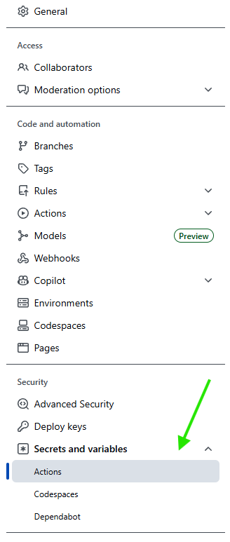
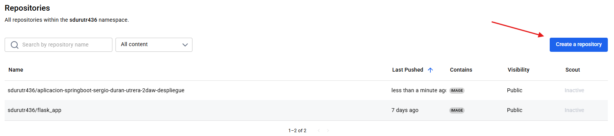
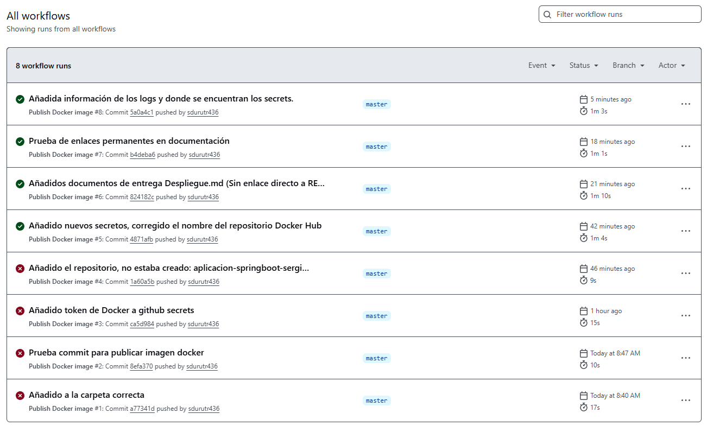
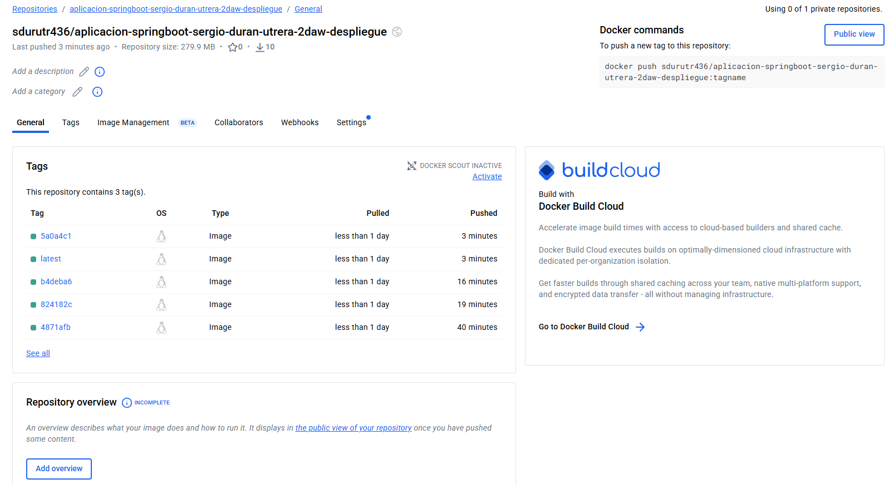

# Despliegue automatizado de la imagen Docker del programa:

Primero, realizamos un fork del repositorio principal:

https://github.com/revilofe/2526_DAW_u2_springboot

Esta aplicación como indica la documentación principal se trata de un CRUD con persistencia para registrar usuarios.

Realizamos un *fork* de ella y clonamos nuestro repositorio.

## Dockerfile y Docker-compose:

El proyecto ya incluye un ``Dockerfile`` y un ``docker-compose`` que construyen la imagen de forma automatizada, para esta práctica, su análisis no es importante, pero levantan todo el contenido de la aplicación web.

## GitHub Actions:

Para automatizar todo completo y tener el contenedor siempre disponible y en su última versión, se crea un *Action* de GitHub para automatizar esto. El archivo se encuentra en ``.github/workflows/docker-image.yml`` para que GitHub Actions lo encuentre.

La acción lo que realiza es:

1. **Se activa automáticamente** cuando hacemos un *push* o una *pull request* a la rama `master`. Esto significa que cada vez que subamos cambios al repositorio, la acción se ejecutará sola:

https://github.com/sdurutr436/2526_DAW_u2_springboot/blob/824182c453ea74807637b6270d0817216c9a24ef/.github/workflows/docker-image.yml#L3-L7

2. **Descarga el código fuente** del repositorio para poder trabajar con él en el servidor de GitHub.

3. **Inicia sesión en Docker Hub** usando las credenciales que hemos guardado como secretos en GitHub (`DOCKER_USERNAME` y `DOCKER_PASSWORD`). Esto es necesario para poder subir la imagen al registro de Docker Hub:

https://github.com/sdurutr436/2526_DAW_u2_springboot/blob/824182c453ea74807637b6270d0817216c9a24ef/.github/workflows/docker-image.yml#L22-L31

4. **Genera las etiquetas (tags)** para la imagen Docker. Se crean dos etiquetas:
   - `latest`: indica que es la versión más reciente
   - Un identificador único basado en el SHA del commit:

https://github.com/sdurutr436/2526_DAW_u2_springboot/blob/824182c453ea74807637b6270d0817216c9a24ef/.github/workflows/docker-image.yml#L33-L40

5. **Construye la imagen Docker** usando el `Dockerfile` del proyecto y la **sube a Docker Hub**. Solo se sube si es un *push* directo, no si es una *pull request* (por seguridad):

https://github.com/sdurutr436/2526_DAW_u2_springboot/blob/824182c453ea74807637b6270d0817216c9a24ef/.github/workflows/docker-image.yml#L42-L50

6. **Genera una certificación de procedencia** (*attestation*) que verifica que la imagen fue construida en GitHub Actions. Esto añade una capa de seguridad y confianza sobre el origen de la imagen.

https://github.com/sdurutr436/2526_DAW_u2_springboot/blob/824182c453ea74807637b6270d0817216c9a24ef/.github/workflows/docker-image.yml#L52-L58

Esta acción la he rescatado de la documentación tutorial de publicar imagenes Docker: https://docs.github.com/es/actions/tutorials/publish-packages/publish-docker-images

### Resultado final

Una vez ejecutada la acción correctamente, la imagen estará disponible en Docker Hub en:

```
sdurutr436/aplicacion-springboot-sergio-duran-utrera-2daw-despliegue
```

---

### Configuración necesaria en GitHub

Para que la acción funcione, es necesario configurar dos **secretos** en el repositorio de GitHub (Settings → Secrets and variables → Actions):

| Secreto | Descripción |
|---------|-------------|
| `DOCKER_USERNAME` | Tu nombre de usuario de Docker Hub |
| `DOCKER_PASSWORD` | Un Access Token generado en Docker Hub (no la contraseña) | 

Esto se encuentra en la configuración de nuestro proyecto como indicaba, en el menú lateral:



Al entrar vemos lo siguiente:


Podemos o configurar un nuevo entorno o directamente las variables. Al pusar en nueva variable se nos abre un menú modal para introducir el nombre de nuestras variables, en mi caso: ``DOCKER_USERNAME`` y ``DOCKER_PASSWORD`` donde tenemos que añadir nuestro usuario y nuestra contraseña. Como alternativa más segura, podemos generar un token de Dockerhub, lo cual sería más seguro, pero para esta práctica, he decido directamente la contraseña por acortar pasos.

### Configuración necesaria en Dockerhub:

Por supuesto, tenemos que generar un repositorio que esté enlazado a las imágenes para su `push`:



El proceso de creación pide un nombre y poco más.

### Despliegue con GitHub Actions

Una vez terminado de configurar todo, al hacer un `push` vemos que se comienza el proceso de la GitHub Action puesta. Los pasos más importantes son los siguientes:

- Login en Docker con los `secrets`:

```
Run docker/login-action@v3
  with:
    username: ***
    password: ***
    logout: true
  env:
    DOCKER_HUB_USERNAME: ***
    IMAGE_NAME: aplicacion-springboot-sergio-duran-utrera-2daw-despliegue
Logging into docker.io...
Login Succeeded!
```

- Y la creación de la imagen:

```
Run docker/build-push-action@v5
  with:
    context: .
    file: ./Dockerfile
    push: true
    tags: ***/aplicacion-springboot-sergio-duran-utrera-2daw-despliegue:latest
  ***/aplicacion-springboot-sergio-duran-utrera-2daw-despliegue:4871afb
    labels: org.opencontainers.image.created=2025-12-04T08:08:45.129Z
  org.opencontainers.image.description=Despliegue de una aplicación spring boot en docker.
  org.opencontainers.image.licenses=
  org.opencontainers.image.revision=4871afb389172e3493615db5aa24467fd2c36ab9
  org.opencontainers.image.source=https://github.com/***/2526_DAW_u2_springboot
  org.opencontainers.image.title=2526_DAW_u2_springboot
  org.opencontainers.image.url=https://github.com/***/2526_DAW_u2_springboot
  org.opencontainers.image.version=latest
    load: false
    no-cache: false
    pull: false
    github-token: ***
  env:
    DOCKER_HUB_USERNAME: ***
    IMAGE_NAME: aplicacion-springboot-sergio-duran-utrera-2daw-despliegue
    DOCKER_METADATA_OUTPUT_VERSION: latest
    DOCKER_METADATA_OUTPUT_TAGS: ***/aplicacion-springboot-sergio-duran-utrera-2daw-despliegue:latest
  ***/aplicacion-springboot-sergio-duran-utrera-2daw-despliegue:4871afb
    DOCKER_METADATA_OUTPUT_TAG_NAMES: latest
  4871afb
    DOCKER_METADATA_OUTPUT_LABELS: org.opencontainers.image.created=2025-12-04T08:08:45.129Z
  org.opencontainers.image.description=Despliegue de una aplicación spring boot en docker.
  org.opencontainers.image.licenses=
  org.opencontainers.image.revision=4871afb389172e3493615db5aa24467fd2c36ab9
  org.opencontainers.image.source=https://github.com/***/2526_DAW_u2_springboot
  org.opencontainers.image.title=2526_DAW_u2_springboot
  org.opencontainers.image.url=https://github.com/***/2526_DAW_u2_springboot
  org.opencontainers.image.version=latest
    DOCKER_METADATA_OUTPUT_ANNOTATIONS: manifest:org.opencontainers.image.created=2025-12-04T08:08:45.129Z
  manifest:org.opencontainers.image.description=Despliegue de una aplicación spring boot en docker.
  manifest:org.opencontainers.image.licenses=
  manifest:org.opencontainers.image.revision=4871afb389172e3493615db5aa24467fd2c36ab9
  manifest:org.opencontainers.image.source=https://github.com/***/2526_DAW_u2_springboot
  manifest:org.opencontainers.image.title=2526_DAW_u2_springboot
  manifest:org.opencontainers.image.url=https://github.com/***/2526_DAW_u2_springboot
  manifest:org.opencontainers.image.version=latest
    DOCKER_METADATA_OUTPUT_JSON: {"tags":["***/aplicacion-springboot-sergio-duran-utrera-2daw-despliegue:latest","***/aplicacion-springboot-sergio-duran-utrera-2daw-despliegue:4871afb"],"tag-names":["latest","4871afb"],"labels":{"org.opencontainers.image.created":"2025-12-04T08:08:45.129Z","org.opencontainers.image.description":"Despliegue de una aplicación spring boot en docker.","org.opencontainers.image.licenses":"","org.opencontainers.image.revision":"4871afb389172e3493615db5aa24467fd2c36ab9","org.opencontainers.image.source":"https://github.com/***/2526_DAW_u2_springboot","org.opencontainers.image.title":"2526_DAW_u2_springboot","org.opencontainers.image.url":"https://github.com/***/2526_DAW_u2_springboot","org.opencontainers.image.version":"latest"},"annotations":["manifest:org.opencontainers.image.created=2025-12-04T08:08:45.129Z","manifest:org.opencontainers.image.description=Despliegue de una aplicación spring boot en docker.","manifest:org.opencontainers.image.licenses=","manifest:org.opencontainers.image.revision=4871afb389172e3493615db5aa24467fd2c36ab9","manifest:org.opencontainers.image.source=https://github.com/***/2526_DAW_u2_springboot","manifest:org.opencontainers.image.title=2526_DAW_u2_springboot","manifest:org.opencontainers.image.url=https://github.com/***/2526_DAW_u2_springboot","manifest:org.opencontainers.image.version=latest"]}
    DOCKER_METADATA_OUTPUT_BAKE_FILE_TAGS: /home/runner/work/_temp/docker-actions-toolkit-5oGGXK/docker-metadata-action-bake-tags.json
    DOCKER_METADATA_OUTPUT_BAKE_FILE_LABELS: /home/runner/work/_temp/docker-actions-toolkit-5oGGXK/docker-metadata-action-bake-labels.json
    DOCKER_METADATA_OUTPUT_BAKE_FILE_ANNOTATIONS: /home/runner/work/_temp/docker-actions-toolkit-5oGGXK/docker-metadata-action-bake-annotations.json
    DOCKER_METADATA_OUTPUT_BAKE_FILE: /home/runner/work/_temp/docker-actions-toolkit-5oGGXK/docker-metadata-action-bake.json
GitHub Actions runtime token ACs
  refs/heads/master: read/write
Docker info
  /usr/bin/docker version
  Client: Docker Engine - Community
   Version:           28.0.4
   API version:       1.48
   Go version:        go1.23.7
   Git commit:        b8034c0
   Built:             Tue Mar 25 15:07:16 2025
   OS/Arch:           linux/amd64
   Context:           default
  
  Server: Docker Engine - Community
   Engine:
    Version:          28.0.4
    API version:      1.48 (minimum version 1.24)
    Go version:       go1.23.7
    Git commit:       6430e49
    Built:            Tue Mar 25 15:07:16 2025
    OS/Arch:          linux/amd64
    Experimental:     false
   containerd:
    Version:          v2.1.5
    GitCommit:        fcd43222d6b07379a4be9786bda52438f0dd16a1
   runc:
    Version:          1.3.3
    GitCommit:        v1.3.3-0-gd842d771
   docker-init:
    Version:          0.19.0
    GitCommit:        de40ad0
  /usr/bin/docker info
  Client: Docker Engine - Community
   Version:    28.0.4
   Context:    default
   Debug Mode: false
   Plugins:
    buildx: Docker Buildx (Docker Inc.)
      Version:  v0.30.1
      Path:     /usr/libexec/docker/cli-plugins/docker-buildx
    compose: Docker Compose (Docker Inc.)
      Version:  v2.38.2
      Path:     /usr/libexec/docker/cli-plugins/docker-compose
  
  Server:
   Containers: 0
    Running: 0
    Paused: 0
    Stopped: 0
   Images: 0
   Server Version: 28.0.4
   Storage Driver: overlay2
    Backing Filesystem: extfs
    Supports d_type: true
    Using metacopy: false
    Native Overlay Diff: false
    userxattr: false
   Logging Driver: json-file
   Cgroup Driver: systemd
   Cgroup Version: 2
   Plugins:
    Volume: local
    Network: bridge host ipvlan macvlan null overlay
    Log: awslogs fluentd gcplogs gelf journald json-file local splunk syslog
   Swarm: inactive
   Runtimes: runc io.containerd.runc.v2
   Default Runtime: runc
   Init Binary: docker-init
   containerd version: fcd43222d6b07379a4be9786bda52438f0dd16a1
   runc version: v1.3.3-0-gd842d771
   init version: de40ad0
   Security Options:
    apparmor
    seccomp
     Profile: builtin
    cgroupns
   Kernel Version: 6.11.0-1018-azure
   Operating System: Ubuntu 24.04.3 LTS
   OSType: linux
   Architecture: x86_64
   CPUs: 4
   Total Memory: 15.62GiB
   Name: runnervmoqczp
   ID: 4ce6fa60-2f23-4ac2-b56a-0440c85af90a
   Docker Root Dir: /var/lib/docker
   Debug Mode: false
   Username: ***
   Experimental: false
   Insecure Registries:
    ::1/128
    127.0.0.0/8
   Live Restore Enabled: false
  
Proxy configuration
  No proxy configuration found
Buildx version
  /usr/bin/docker buildx version
  github.com/docker/buildx v0.30.1 9e66234aa13328a5e75b75aa5574e1ca6d6d9c01
Builder info
  {
    "nodes": [
      {
        "name": "default",
        "endpoint": "default",
        "status": "running",
        "buildkit": "v0.20.2",
        "platforms": "linux/amd64,linux/amd64/v2,linux/amd64/v3,linux/amd64/v4,linux/386",
        "features": {
          "Automatically load images to the Docker Engine image store": true,
          "Cache export": true,
          "Direct push": true,
          "Docker exporter": true,
          "Multi-platform build": true,
          "OCI exporter": true
        },
        "labels": {
          "org.mobyproject.buildkit.worker.moby.host-gateway-ip": "172.17.0.1"
        }
      }
    ],
    "name": "default",
    "driver": "docker"
  }
/usr/bin/docker buildx build --file ./Dockerfile --iidfile /home/runner/work/_temp/docker-actions-toolkit-IQ6Ojs/build-iidfile-98d291380d.txt --label org.opencontainers.image.created=2025-12-04T08:08:45.129Z --label org.opencontainers.image.description=Despliegue de una aplicación spring boot en docker. --label org.opencontainers.image.licenses= --label org.opencontainers.image.revision=4871afb389172e3493615db5aa24467fd2c36ab9 --label org.opencontainers.image.source=https://github.com/***/2526_DAW_u2_springboot --label org.opencontainers.image.title=2526_DAW_u2_springboot --label org.opencontainers.image.url=https://github.com/***/2526_DAW_u2_springboot --label org.opencontainers.image.version=latest --tag ***/aplicacion-springboot-sergio-duran-utrera-2daw-despliegue:latest --tag ***/aplicacion-springboot-sergio-duran-utrera-2daw-despliegue:4871afb --metadata-file /home/runner/work/_temp/docker-actions-toolkit-IQ6Ojs/build-metadata-121f8c4e3e.json --push .
#0 building with "default" instance using docker driver

#1 [internal] load build definition from Dockerfile
#1 transferring dockerfile: 1.17kB 0.0s done
#1 DONE 0.0s

#2 [auth] library/gradle:pull token for registry-1.docker.io
#2 DONE 0.0s

#3 [auth] library/tomcat:pull token for registry-1.docker.io
#3 DONE 0.0s

#4 [internal] load metadata for docker.io/library/gradle:8.5-jdk17
#4 ...

#5 [internal] load metadata for docker.io/library/tomcat:10.1-jdk17
#5 DONE 0.5s

#4 [internal] load metadata for docker.io/library/gradle:8.5-jdk17
#4 DONE 0.5s

#6 [internal] load .dockerignore
#6 transferring context: 362B done
#6 DONE 0.0s

#7 [internal] load build context
#7 transferring context: 77.45kB done
#7 DONE 0.0s

#8 [builder 1/6] FROM docker.io/library/gradle:8.5-jdk17@sha256:7704366590930c03de7e514008ba3d7b7031b92591bd5a74fae79c16f3a17726
#8 resolve docker.io/library/gradle:8.5-jdk17@sha256:7704366590930c03de7e514008ba3d7b7031b92591bd5a74fae79c16f3a17726 done
#8 sha256:521f64de188a3ae1cdf32821464b44693cf9b19cbba5f652a72eb8898353eb88 10.44kB / 10.44kB done
#8 sha256:31bd5f451a847d651a0996256753a9b22a6ea8c65fefb010e77ea9c839fe2fac 0B / 30.45MB 0.1s
#8 sha256:26611c45681a8966387aee7b2e1494405e20bc5a46dc5da0af9228c45f8e8ec4 0B / 17.46MB 0.1s
#8 sha256:7704366590930c03de7e514008ba3d7b7031b92591bd5a74fae79c16f3a17726 1.21kB / 1.21kB done
#8 sha256:f59836e46ad7a565813de06768ff2884700d12b7ceedacb1701a2983dc859010 2.21kB / 2.21kB done
#8 sha256:0a1f4ac6e69541680073b21e32dd3de17885de514e36838468fe84707c7b5acf 0B / 144.90MB 0.1s
#8 sha256:31bd5f451a847d651a0996256753a9b22a6ea8c65fefb010e77ea9c839fe2fac 6.29MB / 30.45MB 0.4s
#8 sha256:26611c45681a8966387aee7b2e1494405e20bc5a46dc5da0af9228c45f8e8ec4 17.46MB / 17.46MB 0.3s done
#8 sha256:0a1f4ac6e69541680073b21e32dd3de17885de514e36838468fe84707c7b5acf 9.44MB / 144.90MB 0.4s
#8 sha256:a36c85a96a6da44b1c1559a390715fd929fae60db504c8b9c745897d737ca485 0B / 173B 0.4s
#8 sha256:31bd5f451a847d651a0996256753a9b22a6ea8c65fefb010e77ea9c839fe2fac 23.07MB / 30.45MB 0.6s
#8 sha256:0a1f4ac6e69541680073b21e32dd3de17885de514e36838468fe84707c7b5acf 20.97MB / 144.90MB 0.6s
#8 sha256:a36c85a96a6da44b1c1559a390715fd929fae60db504c8b9c745897d737ca485 173B / 173B 0.5s done
#8 sha256:30d3df2ee4d87245e77cfd06e96a597422956e0194064b0b71152e77d117ff54 733B / 733B 0.6s done
#8 sha256:d07f8a99f32569a5ebfa8e9c3f4da0166c21ab862fab70f288cac5905e4d76f4 0B / 4.36kB 0.6s
#8 sha256:31bd5f451a847d651a0996256753a9b22a6ea8c65fefb010e77ea9c839fe2fac 29.36MB / 30.45MB 0.7s
#8 sha256:0a1f4ac6e69541680073b21e32dd3de17885de514e36838468fe84707c7b5acf 28.31MB / 144.90MB 0.7s
#8 extracting sha256:31bd5f451a847d651a0996256753a9b22a6ea8c65fefb010e77ea9c839fe2fac
#8 sha256:31bd5f451a847d651a0996256753a9b22a6ea8c65fefb010e77ea9c839fe2fac 30.45MB / 30.45MB 0.7s done
#8 sha256:0a1f4ac6e69541680073b21e32dd3de17885de514e36838468fe84707c7b5acf 36.70MB / 144.90MB 0.8s
#8 sha256:d07f8a99f32569a5ebfa8e9c3f4da0166c21ab862fab70f288cac5905e4d76f4 4.36kB / 4.36kB 0.7s done
#8 sha256:f5b1cf504e03486f25a93789e25d170596a30a0bcddc7396219539ae4d3a3e3b 0B / 132.54MB 0.8s
#8 sha256:aad08408064ed46f64df063070cbdca2e9c201ef791fca8b24f281c176dd595c 0B / 51.55MB 0.8s
#8 sha256:0a1f4ac6e69541680073b21e32dd3de17885de514e36838468fe84707c7b5acf 48.23MB / 144.90MB 1.0s
#8 sha256:f5b1cf504e03486f25a93789e25d170596a30a0bcddc7396219539ae4d3a3e3b 10.49MB / 132.54MB 1.0s
#8 sha256:aad08408064ed46f64df063070cbdca2e9c201ef791fca8b24f281c176dd595c 14.68MB / 51.55MB 1.0s
#8 sha256:f5b1cf504e03486f25a93789e25d170596a30a0bcddc7396219539ae4d3a3e3b 19.92MB / 132.54MB 1.1s
#8 sha256:aad08408064ed46f64df063070cbdca2e9c201ef791fca8b24f281c176dd595c 24.12MB / 51.55MB 1.1s
#8 sha256:0a1f4ac6e69541680073b21e32dd3de17885de514e36838468fe84707c7b5acf 57.67MB / 144.90MB 1.2s
#8 sha256:aad08408064ed46f64df063070cbdca2e9c201ef791fca8b24f281c176dd595c 32.51MB / 51.55MB 1.2s
#8 sha256:f5b1cf504e03486f25a93789e25d170596a30a0bcddc7396219539ae4d3a3e3b 33.55MB / 132.54MB 1.3s
#8 sha256:aad08408064ed46f64df063070cbdca2e9c201ef791fca8b24f281c176dd595c 41.94MB / 51.55MB 1.3s
#8 sha256:0a1f4ac6e69541680073b21e32dd3de17885de514e36838468fe84707c7b5acf 70.25MB / 144.90MB 1.5s
#8 sha256:f5b1cf504e03486f25a93789e25d170596a30a0bcddc7396219539ae4d3a3e3b 53.48MB / 132.54MB 1.5s
#8 sha256:aad08408064ed46f64df063070cbdca2e9c201ef791fca8b24f281c176dd595c 51.55MB / 51.55MB 1.4s done
#8 sha256:f43bfc2819ff808463a651fd1b0d4343062dcbc80dffcd07fb360ca66f98626b 0B / 170B 1.5s
#8 extracting sha256:31bd5f451a847d651a0996256753a9b22a6ea8c65fefb010e77ea9c839fe2fac 0.8s done
#8 sha256:f5b1cf504e03486f25a93789e25d170596a30a0bcddc7396219539ae4d3a3e3b 63.96MB / 132.54MB 1.6s
#8 sha256:f43bfc2819ff808463a651fd1b0d4343062dcbc80dffcd07fb360ca66f98626b 170B / 170B 1.6s done
#8 extracting sha256:26611c45681a8966387aee7b2e1494405e20bc5a46dc5da0af9228c45f8e8ec4
#8 sha256:0a1f4ac6e69541680073b21e32dd3de17885de514e36838468fe84707c7b5acf 78.64MB / 144.90MB 1.7s
#8 sha256:f5b1cf504e03486f25a93789e25d170596a30a0bcddc7396219539ae4d3a3e3b 72.35MB / 132.54MB 1.8s
#8 sha256:0a1f4ac6e69541680073b21e32dd3de17885de514e36838468fe84707c7b5acf 88.34MB / 144.90MB 1.9s
#8 sha256:f5b1cf504e03486f25a93789e25d170596a30a0bcddc7396219539ae4d3a3e3b 80.74MB / 132.54MB 1.9s
#8 sha256:f5b1cf504e03486f25a93789e25d170596a30a0bcddc7396219539ae4d3a3e3b 90.18MB / 132.54MB 2.0s
#8 sha256:0a1f4ac6e69541680073b21e32dd3de17885de514e36838468fe84707c7b5acf 112.20MB / 144.90MB 2.2s
#8 sha256:f5b1cf504e03486f25a93789e25d170596a30a0bcddc7396219539ae4d3a3e3b 105.91MB / 132.54MB 2.2s
#8 sha256:f5b1cf504e03486f25a93789e25d170596a30a0bcddc7396219539ae4d3a3e3b 117.44MB / 132.54MB 2.3s
#8 sha256:0a1f4ac6e69541680073b21e32dd3de17885de514e36838468fe84707c7b5acf 123.73MB / 144.90MB 2.4s
#8 sha256:f5b1cf504e03486f25a93789e25d170596a30a0bcddc7396219539ae4d3a3e3b 125.83MB / 132.54MB 2.4s
#8 extracting sha256:26611c45681a8966387aee7b2e1494405e20bc5a46dc5da0af9228c45f8e8ec4 0.8s done
#8 sha256:f5b1cf504e03486f25a93789e25d170596a30a0bcddc7396219539ae4d3a3e3b 132.54MB / 132.54MB 2.5s
#8 sha256:0a1f4ac6e69541680073b21e32dd3de17885de514e36838468fe84707c7b5acf 144.90MB / 144.90MB 2.7s
#8 sha256:f5b1cf504e03486f25a93789e25d170596a30a0bcddc7396219539ae4d3a3e3b 132.54MB / 132.54MB 3.3s done
#8 sha256:0a1f4ac6e69541680073b21e32dd3de17885de514e36838468fe84707c7b5acf 144.90MB / 144.90MB 3.3s done
#8 extracting sha256:0a1f4ac6e69541680073b21e32dd3de17885de514e36838468fe84707c7b5acf 0.1s
#8 extracting sha256:0a1f4ac6e69541680073b21e32dd3de17885de514e36838468fe84707c7b5acf 1.3s done
#8 extracting sha256:a36c85a96a6da44b1c1559a390715fd929fae60db504c8b9c745897d737ca485 done
#8 extracting sha256:30d3df2ee4d87245e77cfd06e96a597422956e0194064b0b71152e77d117ff54 done
#8 extracting sha256:d07f8a99f32569a5ebfa8e9c3f4da0166c21ab862fab70f288cac5905e4d76f4 done
#8 extracting sha256:aad08408064ed46f64df063070cbdca2e9c201ef791fca8b24f281c176dd595c
#8 ...

#9 [stage-1 1/4] FROM docker.io/library/tomcat:10.1-jdk17@sha256:d2cd0027e6b828ad8a5ff7693a20d972f16af0139f7fcecafa0797b31809863e
#9 resolve docker.io/library/tomcat:10.1-jdk17@sha256:d2cd0027e6b828ad8a5ff7693a20d972f16af0139f7fcecafa0797b31809863e done
#9 sha256:5555010508e0938564d9a2fc6d7c0c3386c896743c142c207014f9b4d1a05a5b 2.72kB / 2.72kB done
#9 sha256:d7e557a209e888a501219479852f290c330a1621b70dfd293cda06f75601789b 13.03kB / 13.03kB done
#9 sha256:d2cd0027e6b828ad8a5ff7693a20d972f16af0139f7fcecafa0797b31809863e 7.97kB / 7.97kB done
#9 sha256:20043066d3d5c78b45520c5707319835ac7d1f3d7f0dded0138ea0897d6a3188 29.72MB / 29.72MB 2.1s done
#9 extracting sha256:20043066d3d5c78b45520c5707319835ac7d1f3d7f0dded0138ea0897d6a3188 1.1s done
#9 sha256:077c4ca28173a06771936e7d2dd6254602c0fa1edee45debed984b4b382915de 22.96MB / 22.96MB 2.9s done
#9 sha256:b88b6ae1b108522b13f2cdc7912b1e5784e2a63268ea6d6d967b4e562b803b6f 144.85MB / 144.85MB 5.0s done
#9 sha256:02d80376fd82870628b01ae6f01bd27552bc9aa3a4cd5be88515f79fe298a87a 2.28kB / 2.28kB 3.8s done
#9 sha256:67cf99ea3a756f77f1989a181feed90c517d46369d9430b6d37e86797f650a47 159B / 159B 4.0s done
#9 extracting sha256:077c4ca28173a06771936e7d2dd6254602c0fa1edee45debed984b4b382915de 1.0s done
#9 sha256:4f4fb700ef54461cfa02571ae0db9a0dc1e0cdb5577484a6d75e68dc38e8acc1 32B / 32B 4.2s done
#9 sha256:ba09cd1b52686ac9e9dbb220adb4ab688596c111fa8403f9fb633cbfbdee0eee 139B / 139B 4.2s done
#9 sha256:6431d88ca8c2ceaed69970f6c943b1b6f48e0a66b8750f8654bd2bf0c977be68 14.34MB / 14.34MB 4.5s done
#9 extracting sha256:b88b6ae1b108522b13f2cdc7912b1e5784e2a63268ea6d6d967b4e562b803b6f 1.4s done
#9 extracting sha256:67cf99ea3a756f77f1989a181feed90c517d46369d9430b6d37e86797f650a47 done
#9 extracting sha256:02d80376fd82870628b01ae6f01bd27552bc9aa3a4cd5be88515f79fe298a87a done
#9 extracting sha256:ba09cd1b52686ac9e9dbb220adb4ab688596c111fa8403f9fb633cbfbdee0eee done
#9 extracting sha256:4f4fb700ef54461cfa02571ae0db9a0dc1e0cdb5577484a6d75e68dc38e8acc1 done
#9 extracting sha256:6431d88ca8c2ceaed69970f6c943b1b6f48e0a66b8750f8654bd2bf0c977be68 0.2s done
#9 DONE 8.0s

#8 [builder 1/6] FROM docker.io/library/gradle:8.5-jdk17@sha256:7704366590930c03de7e514008ba3d7b7031b92591bd5a74fae79c16f3a17726
#8 extracting sha256:aad08408064ed46f64df063070cbdca2e9c201ef791fca8b24f281c176dd595c 2.0s done
#8 ...

#10 [stage-1 2/4] RUN mkdir -p /app/data
#10 DONE 0.1s

#8 [builder 1/6] FROM docker.io/library/gradle:8.5-jdk17@sha256:7704366590930c03de7e514008ba3d7b7031b92591bd5a74fae79c16f3a17726
#8 extracting sha256:f5b1cf504e03486f25a93789e25d170596a30a0bcddc7396219539ae4d3a3e3b 0.1s
#8 ...

#11 [stage-1 3/4] RUN rm -rf /usr/local/tomcat/webapps/*
#11 DONE 0.1s

#8 [builder 1/6] FROM docker.io/library/gradle:8.5-jdk17@sha256:7704366590930c03de7e514008ba3d7b7031b92591bd5a74fae79c16f3a17726
#8 extracting sha256:f5b1cf504e03486f25a93789e25d170596a30a0bcddc7396219539ae4d3a3e3b 0.6s done
#8 extracting sha256:f43bfc2819ff808463a651fd1b0d4343062dcbc80dffcd07fb360ca66f98626b done
#8 DONE 8.8s

#12 [builder 2/6] WORKDIR /app
#12 DONE 0.0s

#13 [builder 3/6] COPY build.gradle settings.gradle gradlew ./
#13 DONE 0.0s

#14 [builder 4/6] COPY gradle ./gradle
#14 DONE 0.0s

#15 [builder 5/6] COPY src ./src
#15 DONE 0.0s

#16 [builder 6/6] RUN chmod +x gradlew && ./gradlew bootWar --no-daemon
#16 0.172 Downloading https://services.gradle.org/distributions/gradle-8.14.3-bin.zip
#16 0.644 .............10%.............20%.............30%.............40%.............50%.............60%.............70%.............80%.............90%..............100%
#16 2.481 
#16 2.482 Welcome to Gradle 8.14.3!
#16 2.482 
#16 2.482 Here are the highlights of this release:
#16 2.482  - Java 24 support
#16 2.482  - GraalVM Native Image toolchain selection
#16 2.482  - Enhancements to test reporting
#16 2.482  - Build Authoring improvements
#16 2.482 
#16 2.482 For more details see https://docs.gradle.org/8.14.3/release-notes.html
#16 2.482 
#16 2.581 To honour the JVM settings for this build a single-use Daemon process will be forked. For more on this, please refer to https://docs.gradle.org/8.14.3/userguide/gradle_daemon.html#sec:disabling_the_daemon in the Gradle documentation.
#16 3.580 Daemon will be stopped at the end of the build 
#16 23.38 > Task :compileJava
#16 23.38 > Task :processResources
#16 23.38 > Task :classes
#16 23.48 > Task :resolveMainClassName
#16 24.18 > Task :bootWar
#16 24.18 
#16 24.18 BUILD SUCCESSFUL in 24s
#16 24.18 4 actionable tasks: 4 executed
#16 DONE 24.3s

#17 [stage-1 4/4] COPY --from=builder /app/build/libs/*.war /usr/local/tomcat/webapps/ROOT.war
#17 DONE 0.0s

#18 exporting to image
#18 exporting layers
#18 exporting layers 0.7s done
#18 writing image sha256:1a84bfb5d33d469e22c06a4761bfa7fc1d09d0571a930a4343f210d88ae47f58 done
#18 naming to docker.io/***/aplicacion-springboot-sergio-duran-utrera-2daw-despliegue:latest done
#18 naming to docker.io/***/aplicacion-springboot-sergio-duran-utrera-2daw-despliegue:4871afb done
#18 DONE 0.7s

#19 resolving provenance for metadata file
#19 DONE 0.0s

#20 pushing ***/aplicacion-springboot-sergio-duran-utrera-2daw-despliegue:latest with docker
#20 pushing layer baa4a4198058
#20 pushing layer 5f70bf18a086
#20 pushing layer cf237025923f
#20 pushing layer 1cebd62ceefc
#20 pushing layer bb3ea38bfd9c
#20 pushing layer db1688142012
#20 pushing layer d03939930dac
#20 pushing layer 35c0b8fb11b1
#20 pushing layer d7ef4463791e
#20 pushing layer e8bce0aabd68
#20 pushing layer baa4a4198058 2.30MB / 22.56MB 0.6s
#20 pushing layer baa4a4198058 6.20MB / 22.56MB 0.7s
#20 pushing layer baa4a4198058 10.10MB / 22.56MB 0.8s
#20 pushing layer baa4a4198058 13.99MB / 22.56MB 0.9s
#20 pushing layer baa4a4198058 17.44MB / 22.56MB 1.0s
#20 pushing layer baa4a4198058 21.11MB / 22.56MB 1.1s
#20 pushing layer baa4a4198058 22.57MB / 22.56MB 1.2s
#20 pushing layer cf237025923f 1.4s done
#20 pushing layer baa4a4198058 2.4s done
#20 pushing layer 5f70bf18a086 5.1s done
#20 pushing layer 1cebd62ceefc 5.1s done
#20 pushing layer bb3ea38bfd9c 5.1s done
#20 pushing layer db1688142012 5.1s done
#20 pushing layer d03939930dac 5.1s done
#20 pushing layer 35c0b8fb11b1 5.1s done
#20 pushing layer d7ef4463791e 5.1s done
#20 pushing layer e8bce0aabd68 5.1s done
#20 DONE 5.2s

#21 pushing ***/aplicacion-springboot-sergio-duran-utrera-2daw-despliegue:4871afb with docker
#21 pushing layer 1cebd62ceefc 1.5s
#21 pushing layer baa4a4198058 3.1s done
#21 pushing layer 5f70bf18a086 3.1s done
#21 pushing layer cf237025923f 3.1s done
#21 pushing layer 1cebd62ceefc 3.1s done
#21 pushing layer bb3ea38bfd9c 3.1s done
#21 pushing layer db1688142012 3.1s done
#21 pushing layer d03939930dac 3.1s done
#21 pushing layer 35c0b8fb11b1 3.1s done
#21 pushing layer d7ef4463791e 3.1s done
#21 pushing layer e8bce0aabd68 3.1s done
#21 DONE 3.1s
ImageID
  sha256:1a84bfb5d33d469e22c06a4761bfa7fc1d09d0571a930a4343f210d88ae47f58
Digest
  sha256:420e82ce58a065f65207ba2c2248de3b7493ff7e9ddafcd641e7de6909fd9511
Metadata
  {
    "buildx.build.provenance": {
      "builder": {
        "id": ""
      },
      "buildType": "https://mobyproject.org/buildkit@v1",
      "materials": [
        {
          "uri": "pkg:docker/gradle@8.5-jdk17?platform=linux%2Famd64",
          "digest": {
            "sha256": "7704366590930c03de7e514008ba3d7b7031b92591bd5a74fae79c16f3a17726"
          }
        },
        {
          "uri": "pkg:docker/tomcat@10.1-jdk17?platform=linux%2Famd64",
          "digest": {
            "sha256": "d2cd0027e6b828ad8a5ff7693a20d972f16af0139f7fcecafa0797b31809863e"
          }
        }
      ],
      "invocation": {
        "configSource": {
          "entryPoint": "Dockerfile"
        },
        "parameters": {
          "frontend": "dockerfile.v0",
          "args": {
            "label:org.opencontainers.image.created": "2025-12-04T08:08:45.129Z",
            "label:org.opencontainers.image.description": "Despliegue de una aplicación spring boot en docker.",
            "label:org.opencontainers.image.licenses": "",
            "label:org.opencontainers.image.revision": "4871afb389172e3493615db5aa24467fd2c36ab9",
            "label:org.opencontainers.image.source": "https://github.com/***/2526_DAW_u2_springboot",
            "label:org.opencontainers.image.title": "2526_DAW_u2_springboot",
            "label:org.opencontainers.image.url": "https://github.com/***/2526_DAW_u2_springboot",
            "label:org.opencontainers.image.version": "latest"
          },
          "locals": [
            {
              "name": "context"
            },
            {
              "name": "dockerfile"
            }
          ]
        },
        "environment": {
          "platform": "linux/amd64"
        }
      }
    },
    "buildx.build.ref": "default/default/2a3hlkwwwjrzxkgg609j5voy2",
    "containerimage.config.digest": "sha256:1a84bfb5d33d469e22c06a4761bfa7fc1d09d0571a930a4343f210d88ae47f58",
    "containerimage.digest": "sha256:420e82ce58a065f65207ba2c2248de3b7493ff7e9ddafcd641e7de6909fd9511",
    "image.name": "docker.io/***/aplicacion-springboot-sergio-duran-utrera-2daw-despliegue:latest,docker.io/***/aplicacion-springboot-sergio-duran-utrera-2daw-despliegue:4871afb"
  }
```

El final es cerrar el código ya que ha terminado de generar todo.

### Comprobación de la imagen en Dockerhub:

Una vez GitHub da el OK:



Podemos dirigirnos a nuestro repositorio de Docker en Dockerhub para comprobar que se están desplegando correctamente:



El enlace a la imagen: https://hub.docker.com/r/sdurutr436/aplicacion-springboot-sergio-duran-utrera-2daw-despliegue

### Estado final de la práctica:

#### Conseguido:

- Crear la acción de GitHub que publica las imagenes automáticamente.
- 